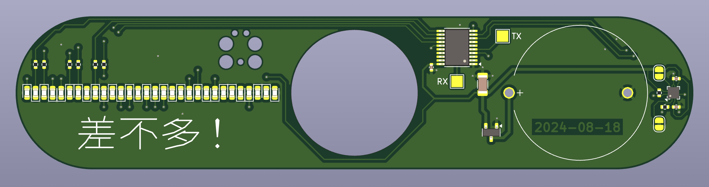

# PY32 fidget spinner demo

This is a quick-and-dirty demo of _just_ how cheap embedded compute can get nowadays &mdash; approximately USD$6 for an *assembled* board with a 32-bit Cortex-M0.

In order to actually make good use of this available compute, the idea was to build a modern (i.e. state-space) control theory estimator to determine the orientation of the fidget spinner from accelerometer data, rather than more traditional approaches involving hall effect sensors.

## Status

Revision A was ordered from JLCPCB, and all of the essential components work.

The state estimator has yet to be written, as the author is aphantasic and not much of a shape rotator (and thus struggling with writing out the necessary "physical world" equations).

## Main components

* PY32F002AL15 (MCU)
* SC7A20 (accelerometer)
* CR2032 battery
* 30 charlieplexed LEDs
